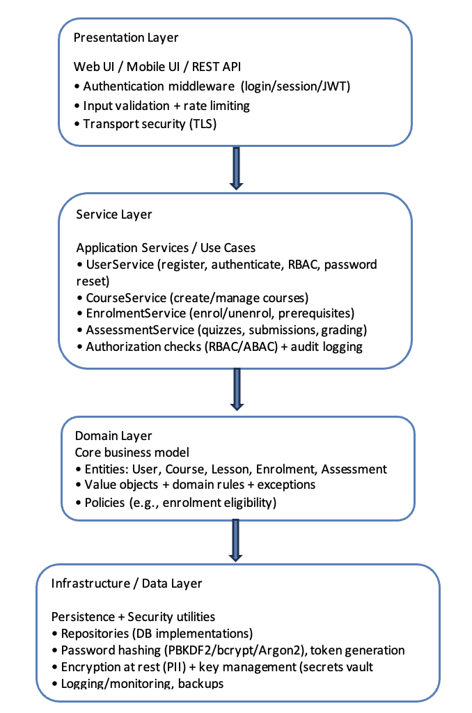
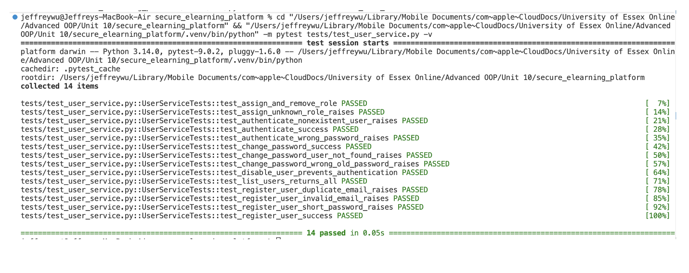

Unit 10 Case study report

1. Software Architecture Design

This project adopts a layered architectural style for the design of a secure e-learning platform. Layered architectures are widely used in enterprise systems as they promote separation of concerns, improve maintainability, and allow individual layers to evolve independently (Bass, Clements and Kazman, 2023). In the context of an e-learning platform, this approach enables clear boundaries between presentation logic, business rules, domain entities, and data persistence.

From a scalability perspective, a modular layered monolith provides a pragmatic foundation. While the system is deployed as a single application, each module is loosely coupled and communicates through well-defined interfaces. This allows future migration to microservices if required, without significant architectural rework (Richards and Ford, 2024). Additionally, centralising security-sensitive functionality within the service layer supports consistent enforcement of authentication and authorisation policies.
The high-level architecture of the system consists of four layers: a presentation layer responsible for user interaction, a service layer that encapsulates business logic and access control, a domain layer containing core entities and rules, and an infrastructure layer that manages persistence and security-related utilities. Figure 1 conceptually illustrates this layered structure.

Figure 1: Conceptual layered architecture of the secure e-learning platform, illustrating separation between presentation, service, domain, and infrastructure layers.

1.1 Key System Modules

The platform is decomposed into several core modules to enhance cohesion and maintainability. These include User Management, Course Management, Enrolment Management, Content Delivery, Assessment and Quizzes, and Administrative Functions. The User Management module is foundational, as it underpins authentication, authorisation, and identity management across the platform.

1.2 Security Considerations

Security is a primary design concern in this system. User authentication is implemented using secure password hashing based on the PBKDF2-HMAC-SHA256 algorithm, in accordance with industry best practices for password storage (OWASP, 2025). Passwords are never stored in plaintext, and each hash is salted to mitigate rainbow table attacks.
Role-based access control (RBAC) is enforced within the service layer to ensure that only authorised users can perform sensitive operations. Input validation is applied to all externally supplied data to reduce the risk of injection attacks. Cryptographically secure random tokens are generated using Python’s secrets module, aligning with guidance provided by the Python Software Foundation (Python Software Foundation, 2025). The overall design aligns with the OWASP Application Security Verification Standard (ASVS) and NIST digital identity guidelines (NIST, 2025; OWASP, 2025).

2. System Implementation

The User Management module was implemented using Python and object-oriented design principles. The module is framework-agnostic and structured to reflect the layered architecture described previously. Core domain entities, such as the User class, encapsulate state and behaviour, while business logic is implemented within a dedicated service layer.
A repository abstraction is used to decouple persistence logic from business rules. For demonstration and testing purposes, an in-memory repository implementation is provided. This approach improves testability and supports future replacement with a database-backed repository without modifying service-layer code.

2.1 Test-Driven Development Approach

Test-Driven Development (TDD) was applied throughout the implementation of the User Management module. Unit tests were written prior to implementing each public service method, defining the expected behaviour and error conditions. The implementation was then incrementally developed to satisfy these tests, followed by refactoring to improve clarity and maintainability while ensuring that all tests continued to pass (Beck, 2023).

2.2 UML Class Diagram

Figure 2 presents the UML class diagram for the implemented User Management module. The diagram illustrates the separation of concerns between domain entities, service-layer logic, and infrastructure components. The UserService class orchestrates application use cases while depending on the UserRepositoryinterface rather than a concrete persistence implementation, thereby supporting dependency inversion and improving maintainability.

The use of an explicit repository interface enables alternative storage mechanisms to be introduced without modifying business logic, while the PasswordHasher class encapsulates all cryptographic operations related to credential management. Visibility modifiers are used to distinguish public interfaces from internal state, reinforcing encapsulation and adherence to object-oriented design principles (Bass, Clements and Kazman, 2023).

 
3. Testing and Validation
 
Comprehensive unit tests were written for all public methods of the UserService class, including user registration, authentication, password changes, account disabling, and role management. These tests validate both normal operation and exceptional conditions, such as invalid credentials and duplicate registrations.
All tests were executed using Python’s unittest framework and passed successfully, providing confidence in the correctness and robustness of the implementation. Refactoring was guided by test results, enabling improvements to code readability and structure without introducing regressions.

Figure 3: Output of automated unit tests executed using Python’s unittest framework, confirming successful validation of all UserService public methods.

 
References

Bass, L., Clements, P. and Kazman, R. (2023) Software Architecture in Practice. 4th edn. Boston: Addison-Wesley.

Beck, K. (2023) Test-Driven Development: By Example. 2nd edn. Boston: Addison-Wesley.

NIST (2025) Digital Identity Guidelines: Authentication and Authenticator Management (SP 800-63B). National Institute of Standards and Technology.

OWASP (2025) Application Security Verification Standard (ASVS). OWASP Foundation.

Python Software Foundation (2025) Python Documentation: secrets module. 
